
# LibraryManager

## Introductie

In deze opgave werk je verder aan een bibliotheekbeheersysteem genaamd LibraryManager. Vervolledig de functionaliteit van het systeem door onderstaande vereisten stapsgewijs te implementeren. 

## Functionele vereisten

- Overzicht tonen van boeken, games en magazines in de bibliotheek.
- Mogelijkheid om nieuwe boeken toe te voegen via een API die data automatisch ophaalt van een externe bron.
- Uitleenstatus van boeken en games bijhouden, tijdschriften (magazines) kunnen niet worden uitgeleend!

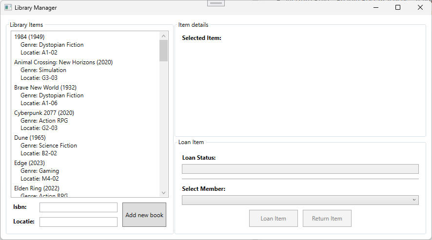

## Architectuur

LibraryManager is opgebouwd uit verschillende projecten:

- LibraryManager.Domain: Bevat de kernlogica en entiteiten van de bibliotheek, zoals boeken, games, tijdschriften en leden.
- LibraryManager.Application: Bevat de services en abstracties die de functionaliteit van de bibliotheek ondersteunen.
- LibraryManager.Infrastructure: Bevat de implementaties van de abstracties.
- LibraryManager.Wpf: Bevat de gebruikersinterface voor interactie met de gebruikers.

## Domain

Vervolledig de `LibraryManager.Domain.Common`- en `LibraryManager.Domain.Enitities` namespace op basis van onderstaande diagram. Pas hierbij de SOLID principes zo goed mogelijk toe!

> [!NOTE]
> Gebruik de bestaande klassen indien aanwezig!

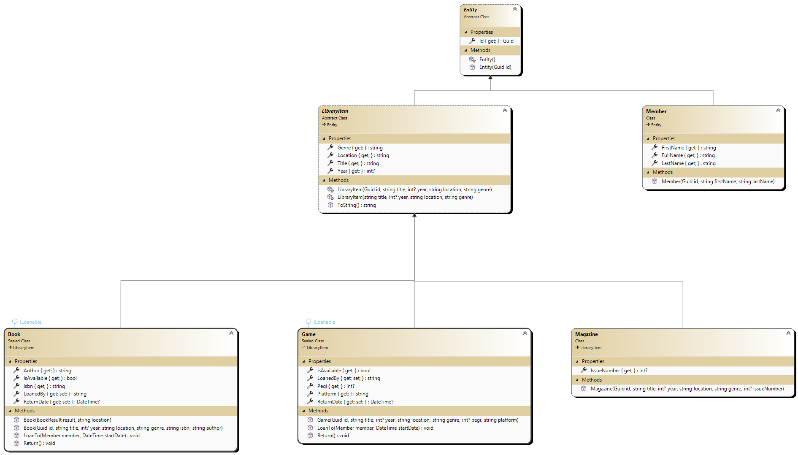

### Basis

- Er kan geen instantie gemaakt worden van de `Entity` of `LibraryItem` klasse
- Gebruik constructor chaining indien mogelijk

### ILoanable

- Implementeer de `ILoanable` interface in de `Book` en `Game` klassen. 
- De `LoanTo` methode:
    - bewaart de naam (`FullName`) van het lid in de `LoanedBy` property
    - berekent de `ReturnDate` op basis van de start datum
        - Een boek kan 28 dagen uitgeleend worden
        - Een game kan 14 dagen uitgeleend worden
- De `Return` methode:
    - zet de `LoanedBy` property terug naar null
    - zet de `ReturnDate` property terug naar null`
- De `IsAvailable` property geeft `true` terug als `LoanedBy` null is, anders `false` 

## Application

### Abstractions

Er werden al een aantal interfaces gedefinieerd in de `LibraryManager.Application.Abstractions` namespace. Deze zijn compleet en moet je verder in deze oefening implementeren.

### MemberService

Vervolledig de klasse `LibraryManager.Application.Services.MemberService`:

- Maak een constructor die een `IMemberRepository` accepteert en sla deze op in een private veld
- Gebruik de `IMemberRepository` om leden te beheren 
- Voorzie de methode `IEnumerable<Member> GetAllMembers()` die alle leden teruggeeft

### LibraryService

Maak een klasse `LibraryManager.Application.Services.LibraryService`:

- Maak een constructor die een `ILibraryItemRepository` en een `IBookApiClient` accepteert en sla deze op in private velden
- Voorzie een methode `CreateBookFromOpenLibraryAsync(string isbn, string location)` die een `Book`-object aanmaakt op basis van gegevens opgehaald van de Open Library API
    - Gebruik de `IBookApiClient` om boekgegevens op te halen op basis van het opgegeven ISBN-nummer
    - Maak een nieuwe `Book` instantie aan met de opgehaalde gegevens en de opgegeven locatie en geef deze terug als resultaat van de methode
- Voorzie een methode `IEnumerable<LibraryItem> GetAllItems()` die alle bibliotheekitems teruggeeft, gebruik hiervoor de ILibraryItemRepository
- Voorzie een methode `void AddItem(LibraryItem item)` die een nieuw bibliotheekitem toevoegt aan de bibliotheek, gebruik hiervoor de ILibraryItemRepository
- Voorzie een methode `void UpdateItem(LibraryItem item)` die een bestaand bibliotheekitem bijwerkt, gebruik hiervoor de ILibraryItemRepository`
- Voorzie een methode `void LoanItem(Guid itemId, Member member, DateTime startDate)`
    - Gebruik de ILibraryItemRepository om het item op te halen op basis van het opgegeven itemId
    - Controleer of het item mag uitgeleend worden met een type check op basis van de `ILoanable` interface. 
    - Contorleer of het item beschikbaar is 
    - Gooi een `InvalidOperationException` als het item niet aan de voorwaarden voldoet om uitgeleend te worden
    - Gebruik de `LoanTo` methode van het item om het uit te lenen aan het opgegeven lid en startdatum
    - Gebruik de ILibraryItemRepository om het bijgewerkte item op te slaan
- Voorzie een methode `void ReturnItem(Guid itemId)`
    - Gebruik de ILibraryItemRepository om het item op te halen op basis van het opgegeven itemId
    - Controleer of het item mag worden teruggebracht met een type check op basis van de `ILoanable` interface
    - Controleer of het item momenteel is uitgeleend
    - Gooi een `InvalidOperationException` als het item niet aan de voorwaarden voldoet om teruggebracht te worden
    - Gebruik de `Return` methode van het item om het terug te brengen
    - Gebruik de ILibraryItemRepository om het bijgewerkte item op te slaan

## Infrastructure

### Repositories

- Implementeer de `ILibraryItemRepository` interface in de bestaande `ItemRepository` klasse. Deze klasse is verantwoordelijk voor het beheren van de bibliotheekitems.
- Implementeer de `IMemberRepository` interface in de bestaande `MemberRepository` klasse. Deze klasse is verantwoordelijk voor het beheren van leden.

> [!NOTE]
> De implementatie van de verschillende methodes is al volledig voorzien in de `ItemRepository` en `MemberRepository` klassen. Je hoeft hier dus geen extra code aan toe te voegen, je moet er alleen voor zorgen dat deze klassen de juiste interfaces implementeren!

### Clients

- Implementeer de `IBookApiClient` interface in de bestaande `BookApiClient` klasse. Deze klasse is verantwoordelijk voor het ophalen van boekgegevens van een externe API.
    - Gebruik `string key = $"ISBN:{new string(isbn.Where(c => char.IsDigit(c)).ToArray())}";` om de ISBN-waarde te formatteren voordat je deze gebruikt om gegevens op te halen van de API.
    - Gebruik `$"https://openlibrary.org/api/books?bibkeys={key}&format=json&jscmd=data"` als URL om boekgegevens op te halen van de Open Library API met een `HttpClient`.
    - Het resultaat van de API-aanroep is een JSON-object dat de boekgegevens bevat. Je kunt deze gegevens deserialiseren naar een `Dictionary<string, OpenLibraryBookDto>`-object.
    - Gebruik bovenstaande `key`-variabele als sleutel om het `OpenLibraryBookDto`-object op te halen uit de dictionary. Dit object bevat de details van het boek.
    - Gebruik de `MapToBookResult` methode om het `OpenLibraryBookDto`-object om te zetten naar een `BookResult` object dat door de applicatie kan worden gebruikt. Omdat het `OpenLibraryBookDto`-object geen isbn waarde bevat moet je deze als extra parameter meegeven aan de `MapToBookResult` methode.

> [!TIP]
> De OpenLibrary DTO klassen vind je terug in de `LibraryManager.Infrastructure/Clients/Models` map. Deze klassen zijn al gedefinieerd en kunnen worden gebruikt om de JSON-respons van de API te deserialiseren.

## Presentation (WPF)

- Maak in de constructor van de `MainWindow` klasse een instantie aan van de `LibraryService` en de `MemberService`
- Gebruik deze services om de functionaliteit van de bibliotheek te ondersteunen in de UI
- Werk alle TODO's in de `MainWindow.xaml.cs` klasse af om de UI te laten functioneren zoals bedoeld

### Item details

#### Boek

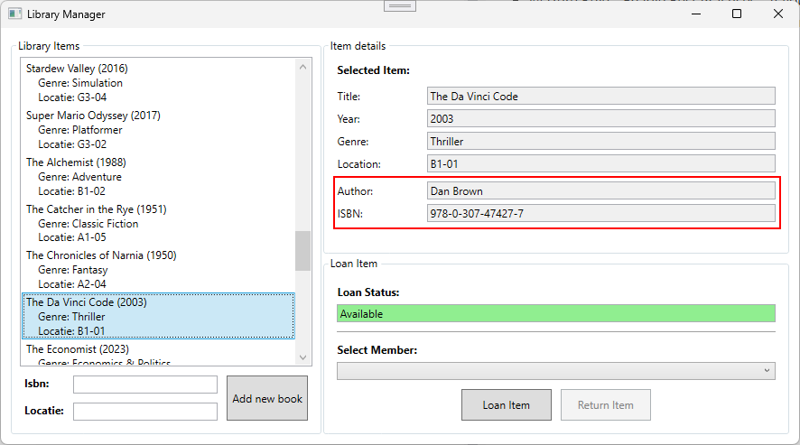

#### Game

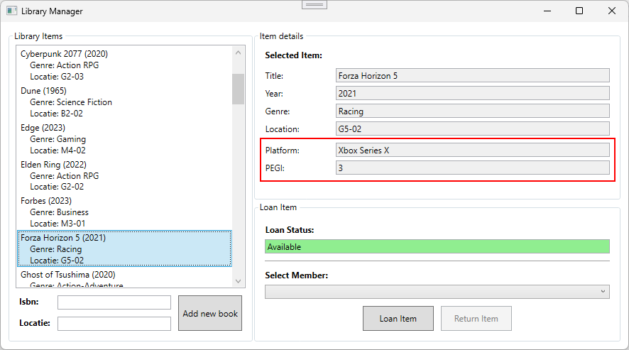

#### Tijdschrift

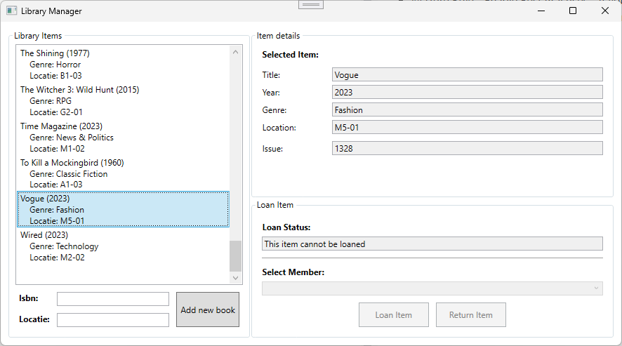

### Loan info

#### Loan

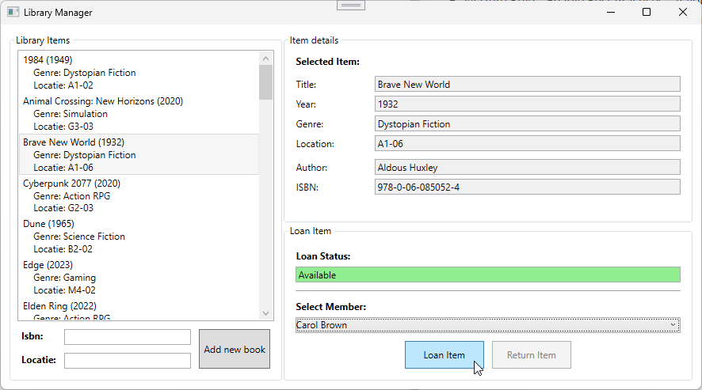
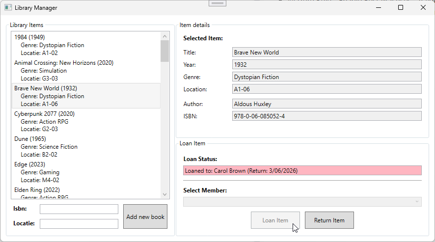

#### Return

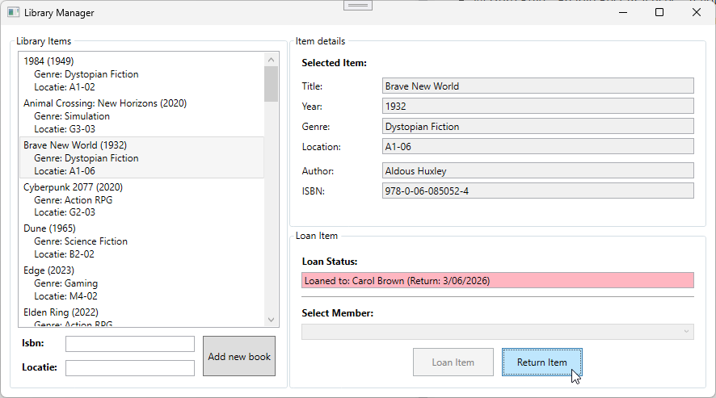
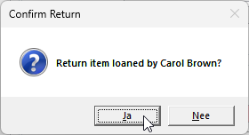

### New book

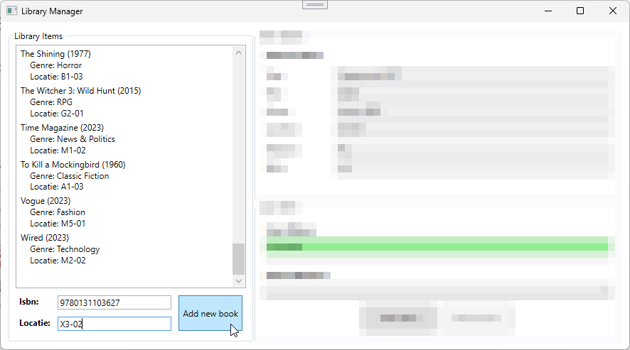
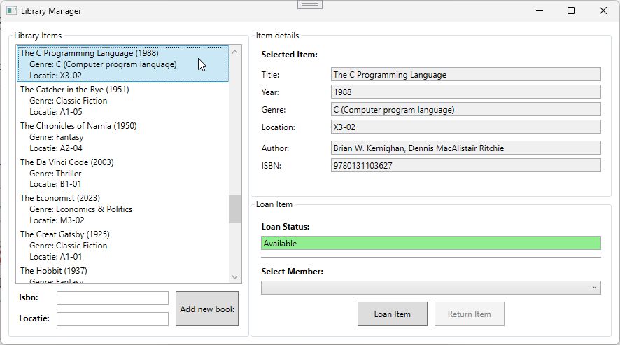

